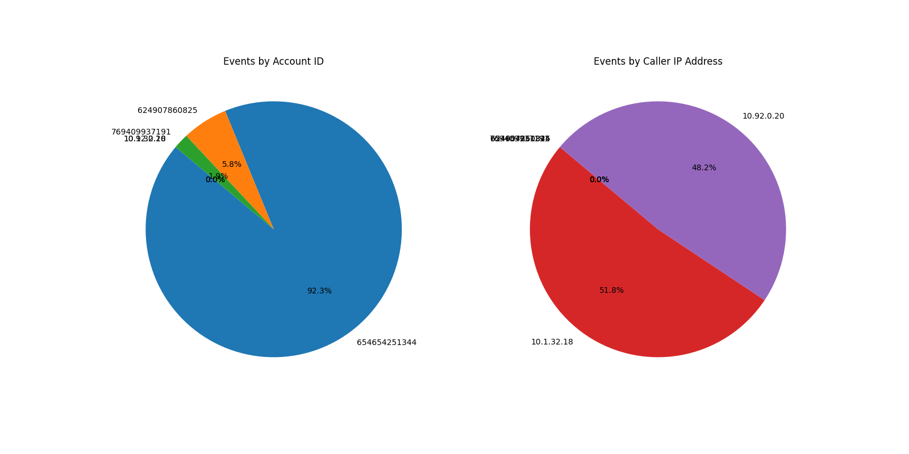

# Log Analyzer and Visualizer

This project is designed for log file analysis, event extraction, and data visualization. It includes modules for log parsing, statistical computations, and plotting using Pandas and Matplotlib.

## Table of Contents

- [Project Description](#project-description)
- [Project Structure](#project-structure)
- [Installation and Setup](#installation-and-setup)
- [Dependencies](#dependencies)
- [Usage](#usage)
- [Download](#download)
- [Results](#results)
- [License](#license)
- [Author](#author)

## Project Description

The project allows you to:
- **Parse Logs:** Extract events from log file lines using the `parse_line` function, handling JSON and tuple representations.
- **Data Analysis:** Count event occurrences, compute average execution time, and group data by account IDs and IP addresses.
- **Visualization:** Create bar charts, pie charts, and line graphs to analyze event statistics and time series.

## Project Structure

- **main.py** – The main script that initiates log analysis. It leverages functions from `pars_modal.py` for log parsing and outputs event statistics.
- **pars_modal.py** – A module that contains functions for parsing log file lines and extracting events.
- **visualizer.py** – A module for generating charts (bar charts, pie charts, and line charts) based on the data extracted from log files.

## Visualisation




## Installation and Setup

1. **Clone the repository:**
   ```bash
   git clone <https://github.com/DmitriyAV/Logigin_test_task>
   cd <Logigin_test_task>

